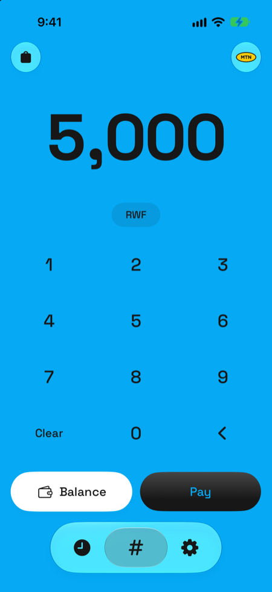
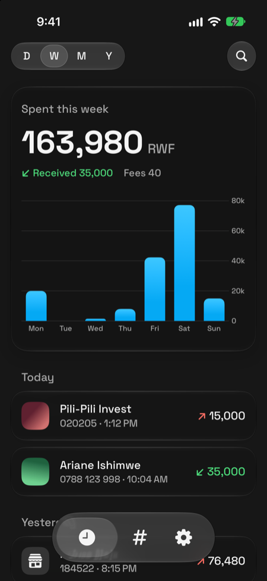
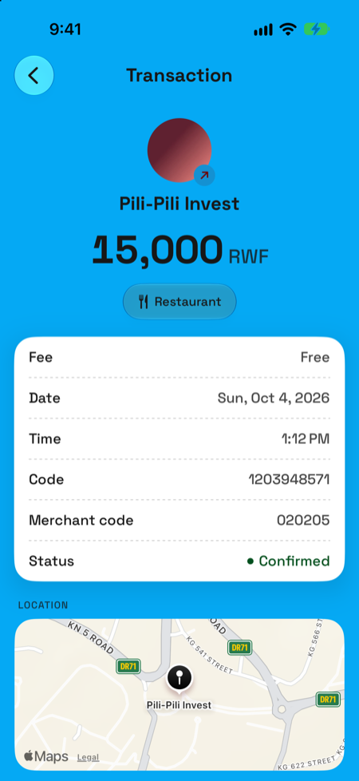
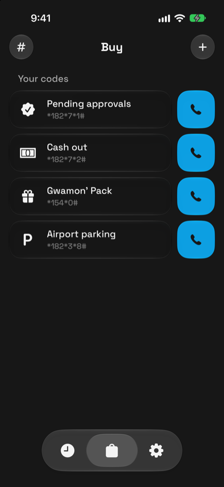

<!-- prettier-ignore -->
<div align="center">


# StarHash

*MTN MoMo and Airtel Money in Rwanda, without the USSD menus.*

[](#getting-started)
[](https://www.swift.org)
[](https://developer.apple.com/xcode/swiftui/)
[](LICENSE)

[Features](#features) • [Getting started](#getting-started) • [How it works](#how-it-works) • [Privacy](#privacy) • [Docs](#documentation)






</div>

StarHash is a free, source-available iPhone app for paying with MTN MoMo or Airtel Money in Rwanda. Type an amount, pick who gets it, and StarHash dials your wallet's USSD code for you, then keeps every payment in one place.

> [!IMPORTANT]
> StarHash never sees your PIN and never moves money. It only dials the code: the iPhone's call prompt, showing the whole code, is your approval, and your wallet's own prompt asks for your PIN as always.

## Features

- **Pay in a few taps**: type an amount, pick a contact, a recent recipient or a merchant code, and the code is dialled at once.
- **Both wallets**: MTN MoMo or Airtel Money, switched from Pay, with the right code for numbers on either network.
- **Activity**: every payment by day, a chart for today, this week, month or year, and search across everything.
- **Auto-verify**: a Shortcuts automation passes your wallet's SMS to StarHash, which confirms each payment with its fee, reference and new balance.
- **Buy**: the codes you dial often (pending approvals, cash out, bundles), one tap each, with up to eight pinned to the top.
- **Nearby**: an opt-in suggestion of the shops you paid where you are standing, never of your contacts.
- **Private by design**: no account, no server, no tracking, and an optional Face ID lock.
- **Shortcuts and Siri**: Pay with StarHash, Check Wallet Balance and Process Carrier SMS.

## Getting started

> [!NOTE]
> StarHash is not on the App Store yet, so for now you build it from source.

You need:

- A Mac with [Xcode 27](https://developer.apple.com/xcode/) and [XcodeGen](https://github.com/yonaskolb/XcodeGen)
- An iPhone on iOS 18 or later, with an MTN or Airtel Rwanda SIM to dial
- An Apple ID for signing (a free personal team works)

Then:

1. Clone the repo and install XcodeGen:
   ```bash
   git clone https://github.com/devbyshima/starhash.git
   cd starhash
   brew install xcodegen
   ```
2. Set your own `DEVELOPMENT_TEAM` and the StarHash target's `PRODUCT_BUNDLE_IDENTIFIER` in `project.yml`.
3. Generate the project and open it:
   ```bash
   xcodegen generate
   open StarHash.xcodeproj
   ```
4. Choose your iPhone and run the **StarHash** scheme.

> [!TIP]
> The simulator cannot dial: Pay shows the code in an alert instead. To look around with sample data, run with the launch arguments `-inMemory -skipOnboarding`.

See [Development](docs/development.md) for the build scripts, tests, screenshots and debug launch arguments.

## How it works

1. You type an amount and pick a recipient. StarHash builds the USSD code, for example `*182*8*1*CODE*AMOUNT#` for a merchant, and opens it as a `tel:` link.
2. The iPhone asks to call, you confirm, and your wallet asks for your PIN.
3. StarHash records the payment as **Pending**. When your wallet's confirmation SMS arrives, the Auto-verify automation marks it **Confirmed** with its fee and reference. You can also confirm it, or mark it failed, by hand.

Every code StarHash dials, and how fees are worked out, is in [Codes and fees](docs/codes-and-fees.md). Setting up the SMS automation is covered in [Auto-verify](docs/auto-verify.md).

> [!WARNING]
> The Airtel Money codes follow Airtel Rwanda's published guides, and its SMS formats follow the template Airtel Africa uses in other countries. Neither has been checked on a real Airtel SIM yet.

## Privacy

- Everything stays on your iPhone: payments in one file, settings in the app's preferences, both part of your own backups.
- StarHash has no network code of its own, no analytics and no third-party packages.
- Contacts are read on the phone only. Location is used only with Nearby on, only while you pay, and never for your contacts. Face ID is asked for only if you turn the lock on.

The full picture is in [Privacy](docs/privacy.md), and the app carries its own Privacy Policy under Settings.

## Documentation

| Page | What's inside |
| --- | --- |
| [Features](docs/features.md) | A tour of Pay, Buy, Activity, Nearby, Settings, Shortcuts and the look |
| [Codes and fees](docs/codes-and-fees.md) | Every USSD code, how numbers are read, and the fee tables |
| [Auto-verify](docs/auto-verify.md) | The Shortcuts automation, how messages are matched, and using it with your own build |
| [Privacy](docs/privacy.md) | Permissions, what is stored where, and what never leaves the phone |
| [Development](docs/development.md) | Requirements, scripts, tests, debug launch arguments and the project layout |
| [Contributing](CONTRIBUTING.md) | Branch rules, commits, pull requests and feature flags |
| [Releasing](RELEASING.md) | Release branches, betas, the App Store and hotfixes, step by step |
| [Changelog](CHANGELOG.md) | What each version changed |

Have an idea? [Request a feature](https://github.com/devbyshima/starhash/issues/new?template=feature_request.yml).

## License

StarHash is source-available under the [PolyForm Noncommercial License 1.0.0](LICENSE).
You may use, study and change it for any non-commercial purpose. Selling it, or using it in
anything that earns money, is not allowed. Versions published before this change remain under GPL-3.0.

The StarHash name and icon are not covered by the license: a modified version must use its own
name and icon.

## Credits

Space Grotesk by Florian Karsten, under the SIL Open Font License 1.1. The MTN and Airtel logos are trademarks of MTN Group and Airtel Africa, shown only to tell the two wallets apart; StarHash is not affiliated with either.
